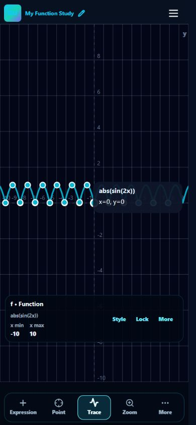
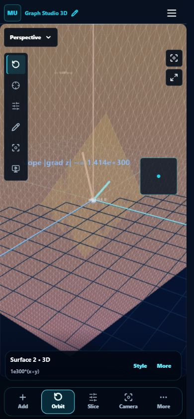

# Same-case manual rerun — 2026-10-03

## Results

| Matrix | Expected UI outcomes met | Rate |
| --- | --- | --- |
| 2D manual | 150 / 150 | 100% |
| 3D manual | 150 / 150 | 100% |
| Existing automated graph matrix (separate check) | 300 / 300 | 100% |

## What passes mean

The same M2-001–M2-150 and M3-001–M3-150 expressions from the previous manual run were re-entered through the live UI at a 390 × 844 Chromium viewport. Valid cases must retain the entered expression, accept it without an unexpected error and expose graph/scene output. Invalid cases must show validation errors without a crash. Domain-empty cases are evaluated against the visible domain. Parameters and selected mathematical markers were reviewed. Browser controls assisted repeated typing and read current DOM; this was not an automated test runner.

This establishes the recorded UI outcomes for this matrix. It does not certify every mesh vertex, every graph function, physical mobile touch/keyboard behavior or all devices. Image export remains unverified from the prior run. Root markers have the existing 12-marker display limit; zero-valued intervals do not receive isolated-root markers. `1e--3*x` is interpreted by the current grammar as Euler-constant multiplication followed by subtraction of a negative term, equivalent to `e+3*x`; it is not treated as a scientific literal.

## Additional bugs fixed in this rerun

1. `abs(sin(2x))` lost tangent-root markers because 48 refinement steps did not reach the strict residual tolerance. Increased the bounded refinement to 80 steps and re-entered affected root cases.
2. Extremely large surface values caused NaN bounding-sphere errors in Three.js. Differential overlays used raw heights/slopes while the surface used a scaled height. The tangent plane, gradient and normal now use the same display scale. Extreme-value and normal/domain-boundary surfaces were rechecked, with no new renderer errors after the fix.

Lint passed for both changed files. `npm run test:graphs:300` passed all 300 existing automated checks.

## Per-case outcomes

Raw observations preserve the complete rerun and later rechecks in [repeat-observations.json](manual-graph-300/repeat-observations.json). Earlier observations remain untouched.

### 2D

| ID | Same input | Expected outcome | Result |
| --- | --- | --- | --- |
| M2-001 | `1e-3*x` | Accepted graph | Pass |
| M2-002 | `2.5e2*x` | Accepted graph | Pass |
| M2-003 | `x^(-1/2)` | Accepted graph | Pass |
| M2-004 | `-2^-2*x` | Accepted graph | Pass |
| M2-005 | `x^2^3` | Accepted graph | Pass |
| M2-006 | `2^(-x^2)` | Accepted graph | Pass |
| M2-007 | `sin(-x)^2` | Accepted graph | Pass |
| M2-008 | `sin(x^2)` | Accepted graph | Pass |
| M2-009 | `cos(2x+pi/3)` | Accepted graph | Pass |
| M2-010 | `exp(-0.2x^2)` | Accepted graph | Pass |
| M2-011 | `ln(x+4)` | Accepted graph | Pass |
| M2-012 | `log(100x)` | Accepted graph | Pass |
| M2-013 | `ln(abs(x))` | Accepted graph | Pass |
| M2-014 | `sqrt(9-x^2)` | Accepted graph | Pass |
| M2-015 | `-sqrt(9-x^2)` | Accepted graph | Pass |
| M2-016 | `sqrt(x-2)` | Accepted graph | Pass |
| M2-017 | `cbrt(x+1)-2` | Accepted graph | Pass |
| M2-018 | `abs(x-3)+1` | Accepted graph | Pass |
| M2-019 | `1/(x-2)` | Accepted graph | Pass |
| M2-020 | `(x^2-1)/(x-1)` | Accepted graph | Pass |
| M2-021 | `tan(x/2)` | Accepted graph | Pass |
| M2-022 | `sec(2x)` | Accepted graph | Pass |
| M2-023 | `csc(x+pi/2)` | Accepted graph | Pass |
| M2-024 | `cot(x-pi/4)` | Accepted graph | Pass |
| M2-025 | `sinh(x/3)` | Accepted graph | Pass |
| M2-026 | `cosh(x/3)-1` | Accepted graph | Pass |
| M2-027 | `tanh(2x)` | Accepted graph | Pass |
| M2-028 | `asin(x/2)` | Accepted graph | Pass |
| M2-029 | `acos(x/2)` | Accepted graph | Pass |
| M2-030 | `atan(3x)` | Accepted graph | Pass |
| M2-031 | `floor(2x)/2` | Accepted graph | Pass |
| M2-032 | `ceil(x/2)` | Accepted graph | Pass |
| M2-033 | `round(3x)/3` | Accepted graph | Pass |
| M2-034 | `sign(x-1)` | Accepted graph | Pass |
| M2-035 | `sinc(4x)` | Accepted graph | Pass |
| M2-036 | `x*abs(x)` | Accepted graph | Pass |
| M2-037 | `abs(sin(2x))` | Accepted graph | Pass |
| M2-038 | `sqrt(abs(x-1))` | Accepted graph | Pass |
| M2-039 | `exp(x/4)-2` | Accepted graph | Pass |
| M2-040 | `ln(1+x^2)` | Accepted graph | Pass |
| M2-041 | `y^2+y=x` | Accepted graph | Pass |
| M2-042 | `x^2+4y^2=16` | Accepted graph | Pass |
| M2-043 | `(x-2)^2+(y+1)^2=9` | Accepted graph | Pass |
| M2-044 | `x*y=4` | Accepted graph | Pass |
| M2-045 | `x^2-y^2=9` | Accepted graph | Pass |
| M2-046 | `x^2+y^2<9` | Accepted graph | Pass |
| M2-047 | `y>sin(x)` | Accepted graph | Pass |
| M2-048 | `y<=2x+3` | Accepted graph | Pass |
| M2-049 | `x>=y^2-2` | Accepted graph | Pass |
| M2-050 | `abs(x)+abs(y)=4` | Accepted graph | Pass |
| M2-051 | `x=sin(2y)` | Accepted graph | Pass |
| M2-052 | `x=exp(-y^2)` | Accepted graph | Pass |
| M2-053 | `x=ln(y+4)` | Accepted graph | Pass |
| M2-054 | `x=sqrt(4-y^2)` | Accepted graph | Pass |
| M2-055 | `Y^3-2Y` | Accepted graph | Pass |
| M2-056 | `x=2Y+5` | Accepted graph | Pass |
| M2-057 | `x=abs(y-2)` | Accepted graph | Pass |
| M2-058 | `x=1/(y+1)` | Accepted graph | Pass |
| M2-059 | `x=cosh(y/2)` | Accepted graph | Pass |
| M2-060 | `x=y^2 {y>=0}` | Accepted graph | Pass |
| M2-061 | `x=2cos(t),y=3sin(t)` | Accepted graph | Pass |
| M2-062 | `x=t^2,y=t^3` | Accepted graph | Pass |
| M2-063 | `x=t+sin(t),y=1-cos(t)` | Accepted graph | Pass |
| M2-064 | `x=cos(3t),y=sin(2t)` | Accepted graph | Pass |
| M2-065 | `r=1+cos(theta)` | Accepted graph | Pass |
| M2-066 | `r=2sin(3theta)` | Accepted graph | Pass |
| M2-067 | `r=theta/3` | Accepted graph | Pass |
| M2-068 | `r=exp(theta/10)` | Accepted graph | Pass |
| M2-069 | `r=1/(1+0.5cos(theta))` | Accepted graph | Pass |
| M2-070 | `r=2,theta=-pi..pi` | Accepted graph | Pass |
| M2-071 | `seq(n^3,0,6)` | Accepted graph | Pass |
| M2-072 | `seq((-1)^n,0,12)` | Accepted graph | Pass |
| M2-073 | `seq(1/n,1,8)` | Accepted graph | Pass |
| M2-074 | `recur(2,prev*2,8)` | Accepted graph | Pass |
| M2-075 | `recur(1,0.5prev+1,12)` | Accepted graph | Pass |
| M2-076 | `cobweb(0.3,3.2x(1-x),12)` | Accepted graph | Pass |
| M2-077 | `contour(x*y,-2;0;2)` | Accepted graph | Pass |
| M2-078 | `vector(x,-y)` | Accepted graph | Pass |
| M2-079 | `slope(sin(x)+y)` | Accepted graph | Pass |
| M2-080 | `param(2t,3t^2,-1,1)` | Accepted graph | Pass |
| M2-081 | `x^2 {-2<x<3}` | Accepted graph | Pass |
| M2-082 | `sin(x) {x>=0}` | Accepted graph | Pass |
| M2-083 | `{x<0:-x^2,x>=0:x^2+1}` | Accepted graph | Pass |
| M2-084 | `{x<-1:-1,-1<=x<1:x,x>=1:1}` | Accepted graph | Pass |
| M2-085 | `{x<0:exp(x),x>=0:exp(-x)}` | Accepted graph | Pass |
| M2-086 | `a*x^2+b` | Accepted graph with parameters | Pass |
| M2-087 | `2a*x+3b` | Accepted graph with parameters | Pass |
| M2-088 | `sin(k*x)+c` | Accepted graph with parameters | Pass |
| M2-089 | `m*(x-h)^2+d` | Accepted graph with parameters | Pass |
| M2-090 | `A*sin(X)+B` | Accepted graph with parameters | Pass |
| M2-091 | `(1.5,-2.25)` | Accepted graph | Pass |
| M2-092 | `(-3.5,4.75)` | Accepted graph | Pass |
| M2-093 | `[0,-2,4,6,-1]` | Accepted graph | Pass |
| M2-094 | `(0,1);(2,3);(-1,-2)` | Accepted graph | Pass |
| M2-095 | `x=4` | Accepted graph | Pass |
| M2-096 | `y=-3.5` | Accepted graph | Pass |
| M2-097 | `x^2+y^2=0` | Accepted graph | Pass |
| M2-098 | `x^2+y^2=-4` | Validation/domain error | Pass |
| M2-099 | `y=1e-4*x+2` | Accepted graph | Pass |
| M2-100 | `x=2.5e-2*y^2` | Accepted graph | Pass |
| M2-101 | `x()` | Validation/domain error | Pass |
| M2-102 | `2()` | Validation/domain error | Pass |
| M2-103 | `cos(x))` | Validation/domain error | Pass |
| M2-104 | `((sin(x))` | Validation/domain error | Pass |
| M2-105 | `x+(2*)` | Validation/domain error | Pass |
| M2-106 | `sqrt(,)` | Validation/domain error | Pass |
| M2-107 | `sin(x,2)` | Validation/domain error | Pass |
| M2-108 | `x^2+*3` | Validation/domain error | Pass |
| M2-109 | `1..5*x` | Validation/domain error | Pass |
| M2-110 | `1e--3*x` | Accepted graph | Pass |
| M2-111 | `x^2==4` | Validation/domain error | Pass |
| M2-112 | `y=>x` | Validation/domain error | Pass |
| M2-113 | `x<` | Validation/domain error | Pass |
| M2-114 | `=x+1` | Validation/domain error | Pass |
| M2-115 | `x=sin(y` | Validation/domain error | Pass |
| M2-116 | `x=t,y=` | Validation/domain error | Pass |
| M2-117 | `r=cos(` | Validation/domain error | Pass |
| M2-118 | `r=2,theta=pi..` | Validation/domain error | Pass |
| M2-119 | `param(t,t^2,0)` | Validation/domain error | Pass |
| M2-120 | `seq(n,5,2)` | Validation/domain error | Pass |
| M2-121 | `seq(n,0,2.5)` | Validation/domain error | Pass |
| M2-122 | `recur(1,prev+,10)` | Validation/domain error | Pass |
| M2-123 | `vector(x)` | Validation/domain error | Pass |
| M2-124 | `slope()` | Validation/domain error | Pass |
| M2-125 | `contour(x*y,)` | Validation/domain error | Pass |
| M2-126 | `{x<0:1,x>=0:}` | Validation/domain error | Pass |
| M2-127 | `x^2 {x<}` | Validation/domain error | Pass |
| M2-128 | `x^2 {0<x<1<2}` | Validation/domain error | Pass |
| M2-129 | `[1,,3]` | Validation/domain error | Pass |
| M2-130 | `(1,2,3)` | Validation/domain error | Pass |
| M2-131 | `x^2+0.000001` | Accepted graph | Pass |
| M2-132 | `(x-1)^2` | Accepted graph | Pass |
| M2-133 | `(x+2)^4` | Accepted graph | Pass |
| M2-134 | `exp(-x^2)-0.5` | Accepted graph | Pass |
| M2-135 | `1/(x^2+0.01)` | Accepted graph | Pass |
| M2-136 | `sin(20x)/(1+x^2)` | Accepted graph | Pass |
| M2-137 | `sqrt(1-x^2) {x>=0}` | Accepted graph | Pass |
| M2-138 | `ln(x+10.01)` | Accepted graph | Pass |
| M2-139 | `y^2=0.25x` | Accepted graph | Pass |
| M2-140 | `x^2+y^2=0.0001` | Accepted graph | Pass |
| M2-141 | `1e300*x` | Accepted graph | Pass |
| M2-142 | `1e-300*x` | Accepted graph | Pass |
| M2-143 | `exp(1000x)` | Accepted graph | Pass |
| M2-144 | `sqrt(-4-x^2)` | No real-domain curve; responsive graph | Pass |
| M2-145 | `ln(-1-x^2)` | No real-domain curve; responsive graph | Pass |
| M2-146 | `x^(1/3)` | Accepted graph | Pass |
| M2-147 | `cbrt(x)^2` | Accepted graph | Pass |
| M2-148 | `sin(x)/x` | Accepted graph | Pass |
| M2-149 | `sqrt(x^2)` | Accepted graph | Pass |
| M2-150 | `(x-1)/(x^2-1)` | Accepted graph | Pass |

### 3D

| ID | Same input | Expected outcome | Result |
| --- | --- | --- | --- |
| M3-001 | `1e-3*(x+y)` | Accepted graph | Pass |
| M3-002 | `2.5e2*x*y` | Accepted graph | Pass |
| M3-003 | `-x^2-y^2` | Accepted graph | Pass |
| M3-004 | `x^(1/3)+y` | Accepted graph | Pass |
| M3-005 | `x^(2/3)-y^2` | Accepted graph | Pass |
| M3-006 | `2^(-x^2-y^2)` | Accepted graph | Pass |
| M3-007 | `exp(-0.2*(x^2+y^2))` | Accepted graph | Pass |
| M3-008 | `sin(-x)^2+cos(y)^2` | Accepted graph | Pass |
| M3-009 | `x^2^3/100+y` | Accepted graph | Pass |
| M3-010 | `-2^-2*(x+y)` | Accepted graph | Pass |
| M3-011 | `ln(x+4)+y` | Accepted graph | Pass |
| M3-012 | `log(100*(x+4))+y` | Accepted graph | Pass |
| M3-013 | `sqrt(9-x^2-y^2)` | Accepted graph | Pass |
| M3-014 | `-sqrt(9-x^2-y^2)` | Accepted graph | Pass |
| M3-015 | `sqrt(x-1)+sqrt(y+2)` | Accepted graph | Pass |
| M3-016 | `ln(abs(x*y))` | Accepted graph | Pass |
| M3-017 | `1/(x-2y+0.5)` | Accepted graph | Pass |
| M3-018 | `(x^2-y^2)/(x-y)` | Accepted graph | Pass |
| M3-019 | `cbrt(x*y)+1` | Accepted graph | Pass |
| M3-020 | `abs(x-1)+abs(y+1)` | Accepted graph | Pass |
| M3-021 | `sin(2x)*cos(3y)` | Accepted graph | Pass |
| M3-022 | `cos(x+y)` | Accepted graph | Pass |
| M3-023 | `sin(x-y)` | Accepted graph | Pass |
| M3-024 | `tan(x/4)+tan(y/4)` | Accepted graph | Pass |
| M3-025 | `sec(x/4)*sec(y/4)` | Accepted graph | Pass |
| M3-026 | `csc(x+pi/2)+y` | Accepted graph | Pass |
| M3-027 | `cot(y+pi/4)+x` | Accepted graph | Pass |
| M3-028 | `sinh(x/3)*cosh(y/3)` | Accepted graph | Pass |
| M3-029 | `tanh(x*y)` | Accepted graph | Pass |
| M3-030 | `sinc(x^2+y^2)` | Accepted graph | Pass |
| M3-031 | `asin(x/4)+acos(y/4)` | Accepted graph | Pass |
| M3-032 | `atan(x*y)` | Accepted graph | Pass |
| M3-033 | `floor(x)+ceil(y)` | Accepted graph | Pass |
| M3-034 | `round(x*y)` | Accepted graph | Pass |
| M3-035 | `sign(x*y)` | Accepted graph | Pass |
| M3-036 | `sqrt(abs(x*y))` | Accepted graph | Pass |
| M3-037 | `ln(1+x^2+y^2)` | Accepted graph | Pass |
| M3-038 | `exp(x/4-y/4)` | Accepted graph | Pass |
| M3-039 | `abs(sin(x)*cos(y))` | Accepted graph | Pass |
| M3-040 | `sin(sqrt(x^2+y^2))/(1+x^2+y^2)` | Accepted graph | Pass |
| M3-041 | `a*x^2+b*y^2` | Accepted graph with parameters | Pass |
| M3-042 | `2a*x+3b*y` | Accepted graph with parameters | Pass |
| M3-043 | `k*exp(-x^2-y^2)` | Accepted graph with parameters | Pass |
| M3-044 | `m*(x-h)^2+n*(y-q)^2` | Accepted graph with parameters | Pass |
| M3-045 | `A*sin(X)+B*cos(Y)` | Accepted graph with parameters | Pass |
| M3-046 | `p*x*y+c` | Accepted graph with parameters | Pass |
| M3-047 | `x^2+y^2-t` | Accepted graph with parameters | Pass |
| M3-048 | `x*cos(t)+y*sin(t)` | Accepted graph with parameters | Pass |
| M3-049 | `sqrt(r^2-x^2-y^2)` | Accepted graph with parameters | Pass |
| M3-050 | `a*sin(b*x)*cos(c*y)` | Accepted graph with parameters | Pass |
| M3-051 | `0.25*(x^4+y^4)-x*y` | Accepted graph | Pass |
| M3-052 | `x^3-3x*y^2` | Accepted graph | Pass |
| M3-053 | `(x^2-y^2)*exp(-x^2-y^2)` | Accepted graph | Pass |
| M3-054 | `sin(3sqrt(x^2+y^2))` | Accepted graph | Pass |
| M3-055 | `cos(x*y)/(1+x^2+y^2)` | Accepted graph | Pass |
| M3-056 | `exp(-abs(x)-abs(y))` | Accepted graph | Pass |
| M3-057 | `1/(1+exp(-x-y))` | Accepted graph | Pass |
| M3-058 | `sqrt(x^2+y^2+0.01)` | Accepted graph | Pass |
| M3-059 | `(x+y)/(1+x^2+y^2)` | Accepted graph | Pass |
| M3-060 | `ln(2+cos(x)+sin(y))` | Accepted graph | Pass |
| M3-061 | `x+y^` | Validation/domain error | Pass |
| M3-062 | `sin(x)*` | Validation/domain error | Pass |
| M3-063 | `sqrt(x+y))` | Validation/domain error | Pass |
| M3-064 | `((x+y)` | Validation/domain error | Pass |
| M3-065 | `x+(y*)` | Validation/domain error | Pass |
| M3-066 | `cos(x,y)` | Validation/domain error | Pass |
| M3-067 | `sqrt(,) + y` | Validation/domain error | Pass |
| M3-068 | `x^2+*y` | Validation/domain error | Pass |
| M3-069 | `1..5*(x+y)` | Validation/domain error | Pass |
| M3-070 | `x=sin(y)` | Validation/domain error | Pass |
| M3-071 | `z==x+y` | Validation/domain error | Pass |
| M3-072 | `z=>x+y` | Validation/domain error | Pass |
| M3-073 | `z=` | Validation/domain error | Pass |
| M3-074 | `x+y;z` | Validation/domain error | Pass |
| M3-075 | `[x,y]` | Validation/domain error | Pass |
| M3-076 | `(x,y,z)` | Validation/domain error | Pass |
| M3-077 | `x**y` | Validation/domain error | Pass |
| M3-078 | `x//y` | Validation/domain error | Pass |
| M3-079 | `x^^y` | Validation/domain error | Pass |
| M3-080 | `exp() + y` | Validation/domain error | Pass |
| M3-081 | `sqrt(-1-x^2-y^2)` | Validation/domain error | Pass |
| M3-082 | `ln(-1-x^2-y^2)` | Validation/domain error | Pass |
| M3-083 | `1/(x-x)` | Validation/domain error | Pass |
| M3-084 | `exp(10000)` | Validation/domain error | Pass |
| M3-085 | `sqrt(0.01-x^2-y^2)` | Accepted graph | Pass |
| M3-086 | `ln(x-10)+y` | Validation/domain error | Pass |
| M3-087 | `sqrt(y-10)+x` | Validation/domain error | Pass |
| M3-088 | `acos(x*100)+y` | Accepted graph | Pass |
| M3-089 | `asin(y*100)+x` | Accepted graph | Pass |
| M3-090 | `x^0.5+y^0.5` | Accepted graph | Pass |
| M3-091 | `1e300*(x+y)` | Accepted graph | Pass |
| M3-092 | `1e-300*(x+y)` | Accepted graph | Pass |
| M3-093 | `exp(500x)+y` | Accepted graph | Pass |
| M3-094 | `x^100+y^100` | Accepted graph | Pass |
| M3-095 | `sqrt(x^2+y^2)^3` | Accepted graph | Pass |
| M3-096 | `sin(40x)*cos(40y)` | Accepted graph | Pass |
| M3-097 | `1/(0.001+x^2+y^2)` | Accepted graph | Pass |
| M3-098 | `(x*y)^(-1/3)` | Accepted graph | Pass |
| M3-099 | `Z=0.5X^2-0.25Y^2` | Accepted graph | Pass |
| M3-100 | `2π*cos(x)+e^(-y^2)` | Accepted graph | Pass |
| M3-101 | `x^2+y^2+z^2=4` | Accepted graph | Pass |
| M3-102 | `(x-1)^2+y^2+z^2=1` | Accepted graph | Pass |
| M3-103 | `x^2+4y^2+9z^2=9` | Accepted graph | Pass |
| M3-104 | `x+y+z=1` | Accepted graph | Pass |
| M3-105 | `x^2+2y^2=3` | Accepted graph | Pass |
| M3-106 | `x^2+y^2-z^2=0` | Accepted graph | Pass |
| M3-107 | `x^2-y^2-z^2=1` | Accepted graph | Pass |
| M3-108 | `x*y*z=1` | Accepted graph | Pass |
| M3-109 | `sin(x)+cos(y)+sin(z)=0` | Accepted graph | Pass |
| M3-110 | `(x^2+y^2+z^2+3)^2=16*(x^2+y^2)` | Accepted graph | Pass |
| M3-111 | `z^2=0` | Accepted graph | Pass |
| M3-112 | `(x+y)^2=0` | Accepted graph | Pass |
| M3-113 | `x^2+y^2+z^2=-1` | Validation/domain error | Pass |
| M3-114 | `x^2+y^2+z^2=` | Validation/domain error | Pass |
| M3-115 | `z=1e-3*x+y` | Accepted graph | Pass |
| M3-116 | `Manual parametric: (2u, 3v, u+v)` | Accepted graph | Pass |
| M3-117 | `Manual parametric: (u, v, u^2-v^2)` | Accepted graph | Pass |
| M3-118 | `Manual parametric: (u*cos(v), u*sin(v), u/2)` | Accepted graph | Pass |
| M3-119 | `Manual parametric: (cos(u)*sin(v), sin(u)*sin(v), cos(v))` | Accepted graph | Pass |
| M3-120 | `Manual parametric: ((3+cos(v))*cos(u), (3+cos(v))*sin(u), sin(v))` | Accepted graph | Pass |
| M3-121 | `Manual parametric: (u*cos(v), u*sin(v), v)` | Accepted graph | Pass |
| M3-122 | `Manual parametric: (cos(u)*(1+v*cos(u/2)), sin(u)*(1+v*cos(u/2)), v*sin(u/2))` | Accepted graph | Pass |
| M3-123 | `Manual parametric: (u, v, exp(-u^2-v^2))` | Accepted graph | Pass |
| M3-124 | `Manual parametric: (U, V, U*V)` | Accepted graph | Pass |
| M3-125 | `Manual parametric: (1e-2*u, 2e-2*v, u+v)` | Accepted graph | Pass |
| M3-126 | `Manual parametric: (u, v, sqrt(4-u^2-v^2))` | Accepted graph | Pass |
| M3-127 | `Manual parametric: (a*u, b*v, 2a*u+3b*v)` | Accepted graph with parameters | Pass |
| M3-128 | `Manual parametric: (sin(u+, v, u*v)` | Validation/domain error | Pass |
| M3-129 | `Manual parametric: (u, v, ln(-1))` | Validation/domain error | Pass |
| M3-130 | `Manual parametric: (u, v, 1/(u-u))` | Validation/domain error | Pass |
| M3-131 | `Manual curve: (2cos(t), 3sin(t), t/2)` | Accepted graph | Pass |
| M3-132 | `Manual curve: (sin(t)+2sin(2t), cos(t)-2cos(2t), -sin(3t))` | Accepted graph | Pass |
| M3-133 | `Manual curve: (cos(3t), sin(2t), sin(t))` | Accepted graph | Pass |
| M3-134 | `Manual curve: (2t, 3t, 4t)` | Accepted graph | Pass |
| M3-135 | `Manual curve: (1e-3*t, t^2, t^3)` | Accepted graph | Pass |
| M3-136 | `Manual curve: (T, T^2, sqrt(T))` | Accepted graph | Pass |
| M3-137 | `Manual curve: (a*cos(t), a*sin(t), b*t)` | Accepted graph with parameters | Pass |
| M3-138 | `Manual curve: (cos(t), sin(t), ln(t+1))` | Accepted graph | Pass |
| M3-139 | `Manual curve: (cos(t+), sin(t), t/2)` | Validation/domain error | Pass |
| M3-140 | `Manual curve: (sqrt(-1), sin(t), t/2)` | Validation/domain error | Pass |
| M3-141 | `Manual field: (x, y, z)` | Accepted graph | Pass |
| M3-142 | `Manual field: (-x, -y, -z)` | Accepted graph | Pass |
| M3-143 | `Manual field: (-y, x, z/2)` | Accepted graph | Pass |
| M3-144 | `Manual field: (1, 2, 3)` | Accepted graph | Pass |
| M3-145 | `Manual field: (sin(y), cos(z), sin(x))` | Accepted graph | Pass |
| M3-146 | `Manual field: (1e-2*x, 2e-2*y, 3e-2*z)` | Accepted graph | Pass |
| M3-147 | `Manual field: (a*x, b*y, c*z)` | Accepted graph with parameters | Pass |
| M3-148 | `Manual field: (x/(1+x^2+y^2+z^2), y/(1+x^2+y^2+z^2), z/(1+x^2+y^2+z^2))` | Accepted graph | Pass |
| M3-149 | `Manual field: (x+, y, z)` | Validation/domain error | Pass |
| M3-150 | `Manual field: (sqrt(-1), y, z)` | Validation/domain error | Pass |

## Screenshots

